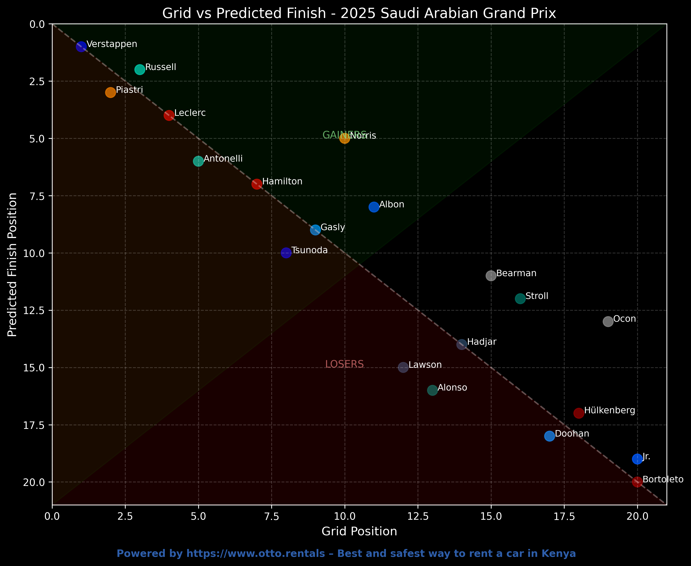
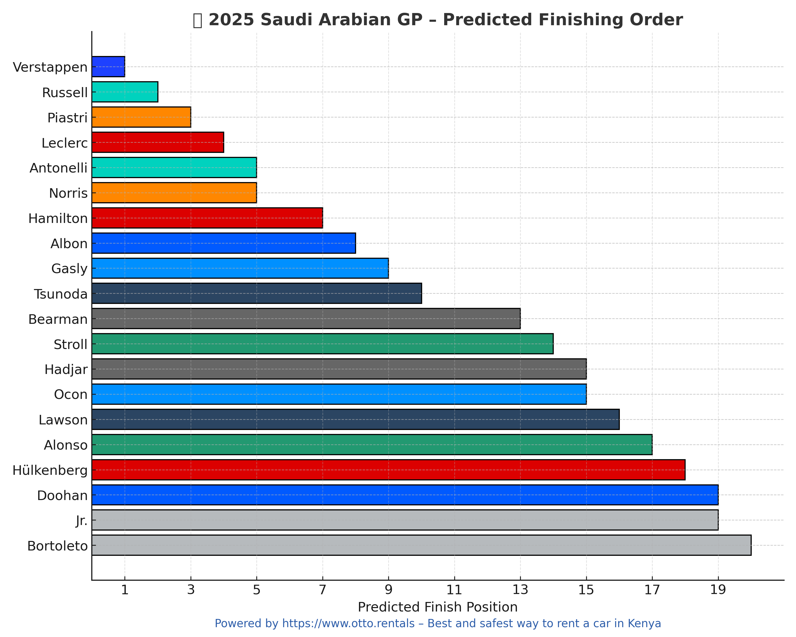
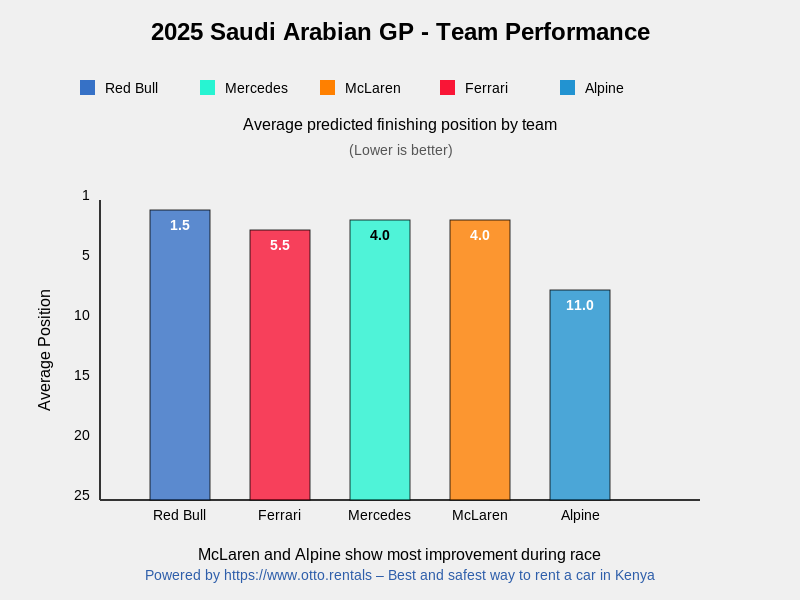

# 2025 Saudi Arabian Grand Prix Prediction – Otto.Rentals F1 Model

This project predicts and visualizes the **2025 Saudi Arabian GP** results using a combination of real F1 performance data, historical race results, and team trends. It's designed for content creation, fan engagement, and motorsport analytics.

## Table of Contents

- [Overview](#overview)
- [Dependencies](#dependencies)
- [Files](#files)
- [How It Works](#how-it-works)
- [How to Run](#how-to-run)
- [Visual Outputs](#visual-outputs)

---

## Overview

The code (`saudi_arabia_v1.py`) analyzes F1 race data from the 2025 season (Bahrain, Australia, Shanghai, Suzuka), historical Saudi GP results (2022–2024), and qualifying data for the 2025 Saudi GP. It outputs predicted finishing positions, points, and several visualizations ideal for social sharing.

---

## Dependencies

Make sure you have the following Python packages installed:

```bash
pip install fastf1 pandas numpy matplotlib seaborn scikit-learn cairosvg
```

> `FastF1` requires `tqdm`, `requests`, and access to internet (for live/historical session data). You may need to install FFMPEG for caching to work smoothly.

---

## Files

| File Name                                      | Description                                                              |
| ---------------------------------------------- | ------------------------------------------------------------------------ |
| `saudi_arabia_v1.py`                           | Main script that calculates predictions and generates all visualizations |
| `saudi_gp_grid_vs_prediction_2025.png`         | Scatter plot comparing grid vs predicted finish                          |
| `saudi_gp_predicted_finish_2025_otto_blue.png` | Horizontal bar chart showing predicted finishing order                   |
| `team_performance_2025_saudi_gp.png`           | Bar chart showing average predicted team positions                       |
| `saudi_gp_track_prediction_2025.png`           | Stylized map of the Jeddah circuit showing top 5 predicted drivers       |
| `saudi_gp_drivers_to_watch_2025.png`           | Top 5 drivers expected to gain the most positions                        |
| `saudi_gp_podium_probability_2025.png`         | Podium probability chart for top 8 drivers                               |

---

## How It Works

### 1. **Data Collection**

- Loads 2025 race results from 4 races (`Bahrain`, `Australia`, `Shanghai`, `Suzuka`)
- Loads historical data for Saudi GP from 2022–2024 using `FastF1`
- Qualifying positions are taken from the provided 2025 Saudi Arabia Q1–Q3 data

### 2. **Feature Engineering**

For each driver:

- Average 2025 race position
- Average points per race
- Average position change between races
- Performance history in Saudi (grid-to-finish delta, experience)
- Qualifying position for this race

### 3. **Prediction Formula**

Instead of training a complex model, a rule-based weighted formula predicts race finish based on:

- Grid position (30%)
- Average season position (30%)
- Saudi track performance (20%)
- Overtake skill and track experience (20%)

### 4. **Visualizations**

#### Grid vs Prediction Chart

Shows which drivers are expected to **gain** or **lose** positions.



#### Predicted Finish Bar Chart

Displays predicted finishing order using **team colors**.



#### Team Performance Summary

Average predicted position and points per team.



#### Circuit Overview with Top Drivers

Custom Jeddah Corniche track map with top 5 drivers placed.


#### Drivers to Watch

Top 5 drivers expected to improve the most from grid to finish.


#### Podium Probability

Chance of each driver making it to the podium.


---

## How to Run

### 1. Clone or download this repo

Make sure `saudi_arabia_v1.py` and the relevant CSV/data files are in the same directory.

### 2. Run the script

```bash
python saudi_arabia_v1.py
```

### 3. Outputs

You’ll find all the image files saved in your working directory:

- `*.png` files will be high-quality, social-ready images.

---

## Attribution

All visualizations are powered by:
**[Otto.Rentals](https://www.otto.rentals)** – _The best and safest way to rent a car in Kenya – trusted by thousands of drivers._
